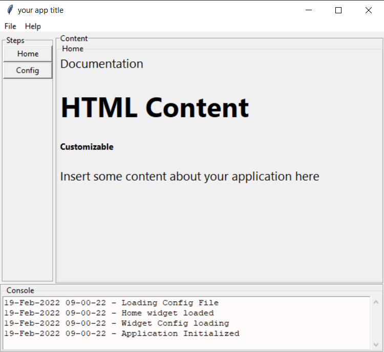

## Alec's Object-Oriented Tkinter Objects
Greetings! I hope this finds you well.

This is a collection of Object-Oriented tkinter object I've created for usage in my projects.

I've designed this project to demonstrate how one may want to create a Tkinter application.
Please feel free to use it as a starter template for your projects.

## Installation
```
git clone https://github.com/alecsanchez94/alecs_oo_tkinter_objects.git
pip install -r requirements.txt
python application.py

```



## Features
1. Object-Oriented Design Pattern with prebuilt widgets
   1. WidgetChangelog
   2. WidgetTextbox
   3. WidgetTable
   4. WidgetRichTextEditor
   5. WidgetProgressTextAndBar
   6. WidgetPopupProgress
   7. WidgetDynamicContainer
   8. WidgetChangelog
2. Config Parser for settings
3. Minimizable to system tray


## Credits
1. Rich Text Editor
   1. Original repo: https://github.com/amandeep511997/Text-Editor
   2. Converted to a Class
   3. Thank you to amandeep511997! for the original repo

